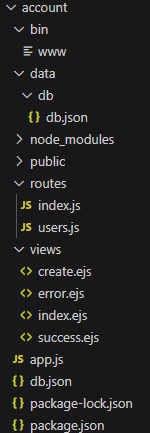

## 一、 CommonJS 规范
module.exports、exports 以及 require 这些都是 CommonJS 模块化规范中的内容。
而 Node.js 是实现了 CommonJS 模块化规范，二者关系有点像 JavaScript 和 ECMAScript

### 包管理工具

#### 概念介绍
##### 包是什么
[包]英文英文单词是package，代表了一组特定功能的源码集合

##### 包管理工具
管理[包]的应用软件，可以对[包]进行下载安装、更新、删除、上传等才做  
借助包管理工具，可以快速开发项目，提升开发效率  

##### 常用的包管理工具
* **npm**
* yarn
* cnpm

#### npm
npm 全称 **Node Package Manger**，翻译为中文意思是[Node 的包管理工具]  
npm 是 node.js官方内置的包管理工具，是**必须要掌握的工具**

##### npm的安装

node.js在安装时会 **自动安装npm**，所以如果你已经安装了node.js，可以直接使用npm  
可以通过 `npm -v` 查看版本号测试，如果显示版本号说明安装成功，反之安装失败 

##### npm基本使用

###### 初始化
创建一个空目录，然后以此目录作为工作目录启动**命令行工具**，执行 `npm init`  
`npm init` 命令的作用是将文件夹初始化为一个[包]，**交互式创建package.json文件**  
`package.json` 是包的配置文件，每个包都必须要有` package.json`

> 初始化过程还有一些注意事项：  
> 1. package name(**包名**)不能使用中文、大写，默认值是**文件夹的名称**，所以文件夹名称也不能使用中文和大写
> 2. version(**版本号**)要求`x.x.x`的形式定义，x必须是数字，默认值是`1.0.0`
> 3. ISC 证书与MIT证书功能上是相同的，关于开原证书扩展阅读
> 4. `package.json` 可以手动创建和修改
> 5. 使用 `npm init -y` 或者 `npm init --yes` 极速创建**package.json**

###### 搜索包

搜索包的方式有两种
1. 命令行 [`npm s/search 关键字`]
2. **网站搜索** 网址是[http://www.npmjs.com/](http://www.npmjs.com/)

###### 下载安装包
通过 `npm install` 和 `npm i` 命令安装包
```npm
<!-- 格式 -->
npm install <包名>
npm i <包名>

<!-- 示例 -->
npm install uniq
npm i uniq
```

```js
// 1.导入uniq包
// uniq:Removes all duplicates from an array in place
const uniq = require('uniq'); // 推荐
// const uniq = require('./node_modules/uniq');
// const uniq = require('./node_modules/uniq/uniq.js');

// 2.使用函数
let arr = [1,2,3,4,5,4,3,2,1];
const result = uniq(arr);
console.log(result);
// [ 1, 2, 3, 4, 5 ]
```

运行止呕文件夹下会增加两个资源
* `node_modules` **文件夹**存放下载的包
* `package-lock.json` **包的锁文件**，用来锁定包的版本

> 安装 uniq 之后，uniq 就是当前这个包的一个**依赖包**，有时会简称为**依赖**  
> 比如我们创建了一个包名字为A，A中安装了包名字是B，我们就说**B是A的一个依赖包**，也会说**A依赖B**

###### require 导入 npm 包的基本流程

1. 在当前文件夹下 node_modules 中寻找同名的文件夹
2. 在上级目录中下的 node_modules 中训中同名的文件夹，直至找到磁盘根目录


##### 生产环境与开发环境

开发环境是程序员 **专门用来写代码** 的环境，一般是指程序员的电脑，开发环境的项目一般 **只能程序员自己访问**  
生产环境是项目**代码正式运行** 的环境，一般是指正式的服务器电脑，生产环境的项目一般 **每个客户否可以访问**  

##### 生产依赖与开发依赖
可以在安装时设置选项来区分**依赖的类型**，目前分为两类：

| 类型     | 命令                                |补充|
| :------: | ----------------------------------- |----| 
| 生产依赖 | npm i -S uniq <br> npm i --save uniq    | -S 等效于 --save，**-S 是默认选项**<br> 包信息保存在 package.json 中 **dependencies** 属性 |
| 开发依赖 | npm i -D less<br> npm i --save-dev less | -D 等效于 --save-dev<br> 包信息保存在package.json中 **devDependencies** 属性 |

##### 全局安装

可以执行安装选项 `-g` 进行全局安装  
`npm i -g nodemon`  
全局安装完成之后就可以在命令行的任何位置运行 `nodemon` 命令  `nodemon ./test.js`
该命令的作用是 **自动重启 node 应用程序**  
> 说明：
> 全局安装的命令不收工作目录位置影响
> 可以通过 `npm root -g` 可以查看全局安装包的位置
> **不是所有的包都适合全局安装**，只有全局类的工具才适合，可以通过[**查看包的官方文档来确定安装方式**](http://www.npmjs.com/)

###### 修改windows执行策略


windows 默认不允许 npm 全局命令执行脚本文件，所以需要修改执行策略
1. 以**管理员身份**打开powershell命令行
2. 键入命令 `set-ExecutionPolicy remoteSigned`

  
或者选择其他终端执行命令

###### 环境变量Path

Path是操作系统的一个环境变量，可以设置一些文件夹的路径，在当前工作目录下找不到可执行文件时，就会在环境变量Path的目录中挨个的查找，如果找到则执行，如果没有找到就会报错。

> 补充说明：
> * 如果希望某个程序在任何工作目录下都能正常运行，就应该将程序的所在目录配置到环境变量 Path 中
> * windows 下查找命令的所在位置
>   - **cmd 命令行**中执行 `where nodemon`
>   - **powershell命令**执行 `get-command nodemon `

##### 安装包依赖

在项目协作中有一个常用的命令就是 npm i,通过该命令可以依据 package.json 和 package-lock.json 的依赖声明安装项目依赖
```
npm i
npm install
```
> node_modules文件夹大多数情况都不会存入版本库

##### 安装指定版本的包
项目中可能会遇到版本不匹配的情况，有时就需要安装指定版本的包，可以使用下面的命令
```npm
<!-- 格式 -->
npm i <包名@版本号>
<!-- 实例 -->
npm i jquery@1.11.2
```
##### 删除依赖
项目中可能需要删除某些不需要的包，可以使用下面的命令
```npm
<!--局部删除-->
npm remove uniq
npm r uniq
<!-- 全局删除 -->
npm remove -g nodemon
```

##### 配置命令别名
通过配置命令别名可以更简单的执行命令
配置package.json中的 `scripts` 属性
```json
{
  ...
  "scripts": {
    "test": "echo \"Error: no test specified\" && exit 1",
    "server":"node test.js",
    "start": "node test.js"
  },
  ...
}
```

配置完成之后，可以使用别名执行命令  
`npm run server`    
`npm run start`  
**start** 别名比较特别，使用时可以省略 `run`  
`npm start`

> 补充说明：
> * `npm start` 是项目中常用的一个命令，一般用来启动项目
> * `npm run` 有自动向上级目录查找的特性，跟require函数也一样
> * 对于陌生的项目，可以通过查看scripts 属性来参考项目的一些操作

#### cnpm

##### cnpm 介绍
cnpm（China Node Package Manager） 是一个淘宝构建的 `npmjs.com` 的完整镜像，也称为[淘宝镜像],网址[http://npmmirror.com/](http://npmmirror.com/)  
cnpm 服务部署在国内 **阿里云服务器上**，可以提高包的下载速度  
官方也提供了一个全部工具包cnpm，操作命令与npm大体相同

##### cnpm安装

我们可以通过 npm 来安装cnpm 工具  
```
npm install -g cnpm --registry=https://registry.npmmirror.com
```
查看 cnpm 版本  
```
cnpm -v
```
##### 操作命令
|功能|命令|
|:-|:-|
|初始化|cnpm init |
|安装包|cnpm i uniq <br> cnpm i -S uniq<br>cnpm i -D uniq<br>cnpm i -g ndoemon|
|安装项目依赖|cnpm i|
|删除|cnpm r uniq|

##### npm 配置淘宝镜像
用 npm 也可以使用淘宝镜像，配置的方式有两种
* 直接配置
* 工具配置

###### 直接配置
执行如下命令即可完成配置  
```
npm config set registry https://registry.npmmirror.com/
```

###### 工具配置
使用 `nrm` （npm registry maneger）配置 npm 的镜像地址 
1. 安装 nrm  
    ```
    npm i -g nrm
    ```
2. 修改镜像  
    ```
    nrm use taobao
    ```
3. 检查配置是否成功(选做)  
    ```
    npm config list
    ```
    检查 registry地址是否为https://registry.npmmirror.com/，如果**是**则表明成功
    
> 补充说明：
> 1. **建议使用第二种方式**进行镜像配置，因为后续修改起来会比较方便
> 2. 虽然 cnpm 可以提高速度，但是 npm 也可以通过淘宝镜像进行加速，所以 **npm 的使用率还是高于cnpm**
> 3. 通过 `nrm ls` 可以查看当前配置的所有镜像源


#### yarn
##### yarn介绍

yarn 是由 Facebook 在2016 年推出的心得 Javascript 包管理工具，官方网址: [https://yarnpkg.com/](https://yarnpkg.com/)

##### yarn特点
yarn 官方宣称的一些特点
* 速度超快：yarn缓存了每个下载过的包，所以再次使用时无需重复下载，同时利用并行下载以最大化资源利用率，因此安装速度更快
* 超级安全：在执行代码之前，yarn会通过算法校验每个安装包的完整性
* 超级可靠：使用详细、简洁的锁文件格式和明确的安装算法，yarn能够保证在不同系统上无差异的工作

##### yarn安装
可以使用npm安装yarn  
`npm i -g yarn`

##### yarn常用命令

| 功能         | 命令                                                         |
| ------------ | ------------------------------------------------------------ |
| 初始化       | yarn init / yarn init -y                                     |
| 安装包       | yarn add uniq 生产依赖 <br>yarn add less -- dev 开发依赖 <br>yarn global add nodemon 全局安装 |
| 删除包       | yarn remove uniq 删除项目依赖包<br>yarn global remove nodemon 全局删除包 |
| 安装项目依赖 | yarn                                                         |
| 运行命令别名 | yarn <别名>  # 不需要添加 `run`                              |

> 思考题：
> 全局安装的包不可用，yarn全局安装包的位置可以通过`yarn global bin`来查看，然后将他的路径添加到环境变量中去。

##### yarn配置淘宝镜像
可以通过如下命令配置淘宝镜像
```
yarn config set registry https://registry.npmmirror.com/
```
可以通过`yarn config list`查看yarn的配置项

##### npm 和 yarn 选择
1. 个人项目
    如果是个人项目，**哪个工具都可以**，可以根据自己的喜好来选择
2. 公司项目
    如果是公司要根据项目代码来选择，可以**通过锁文件判断**项目的包管理工具
    * npm  的锁文件为 `package-lock.json`
    * yarn 的锁文件为 `yarn.lock`
    
> **包管理工具不要混着用！！**

#### 管理发布包

##### 创建与发布
我们可以将自己开发的工具包发布到 npm 服务上，方便自己和其他开发者使用，操作步骤如下：
1. 创建文件夹，并创建文件index.js，在文件中声明函数，使用 module.exports暴露
2. npm 初始化工具包，package.json填写包的信息（包的名字是唯一的）
3. 注册账号 [https://www.npmjs.com/signup](https://www.npmjs.com/signup)
4. 激活账号
5. 修改为官方的官方镜像（命令行中运行 `nrm usr npm`）
6. 命令行下`npm login`填写相关用户信息
7. 命令行下`npm publish`提交包

##### 更新包
后续可以对自己发布的包进行更新，操作步骤如下：
1. 更新包中的代码
2. 测试代码是否可用
3. 修改 **package.json** 中的版本号
4. 发布更新 `npm publish`

##### 删除包
执行如下命令删除包
`npm unpublish( --force)`

> 删除包需要满足一定的条件，[https://docs.npmjs.com/policies/unpublish](https://docs.npmjs.com/policies/unpublish)
> * 你是包的作者
> * 发布小于24小时
> * 大于24小时后，没有其他包依赖，并且每周小于300下载量，并且只有一个维护者

##### 扩展内容

在很多语言中都有包管理工具，比如：

| 语言       | 包管理工具          |
| ---------- | ------------------- |
| PHP        | composer            |
| Python     | pip                 |
| Java       | maven               |
| Go         | go mod              |
| JavaScript | npm/yarn/cnpm/other |
| Ruby       | rubyGems            |

除了编程语言领域有包管理工具之外，操作系统层面也存在包管理工具，不过这个包指的是[**软件包**]

| 操作系统 | 包管理工具 | 网址                               |
| -------- | ---------- | ---------------------------------- |
| Centos   | yum        | https://package.debian.org/stable/ |
| Ubuntu   | apt        | https://package.ubuntu.com/        |
| MacOS    | homebrew   | https://brew.sh/                   |
| Windows  | chocolatey | https://chocolatey.org/            |

#### nvm
##### 介绍
nvm 全称 **Node Version Manager** 顾名思义它是用来管理 node 版本的工具，方便切换不同版本的Node.js
##### 使用
nvm 的使用与 npm 相似
###### 下载安装
首先下载 nvm，下载地址[https://github.com/coreybutler/nvm-windows/releases](https://github.com/coreybutler/nvm-windows/releases),选择 **nvm-setup.exe** 下载
###### 常用命令

| 命令                  | 说明                          |
| --------------------- | ----------------------------- |
| nvm list available    | 显示所有可以下载的Node.js版本 |
| nvm list/nvm ls       | 显示已安装的版本              |
| nvm install 18.12.1   | 安装18.12.1版本的Node.js      |
| nvm install latest    | 安装最新版的Node.js           |
| nvm uninstall 18.12.1 | 删除某个版本的Node.js         |
| nvm use 18.12.1       | 切换18.12.1的Node.js          |

## 二、 ExpressJS

### 2.1 express介绍

express 是一个基于 Node.js 平台的极简、灵活的WEB应用开发框架，官网[https://www.expressjs.com.cn/](https://www.expressjs.com.cn/) 简单来说，express是一个封装好的工具包，封装了很多功能，便于我们开发WEB应用（HTTP服务）

### 2.2 express使用

```js
// 1.导入 express
const express = require('express')
// 2.创建应用对象
const app = express();
// 3.创建路由
app.get('/home',(req,res) => {
    res.end('hello express');
})
// 4.监听端口，启动服务
app.listen(3000,() => {
    console.log('服务已启动，正在监听端口3000...');
})
```

### 2.3 express 下载
express本身是一个npm包，所以可以通过npm安装`npm i express`

### 2.4 express 路由

**什么是路由**

> 路由确定了应用程序如何响应客户端对特定端点的请求

**路由的使用**

> 一个路由的组成有 **请求方法**，**路径**和**回调函数**组成
express 中提供了一系列方法，可以很方便的使用录用，使用格式如下：  
`app.<method>(path, callback)`

```js
// 1.导入 express
const express = require('express')
// 2.创建应用对象
const app = express();
// 3.创建路由
app.get('/',(req,res) => {
    res.end('hello');  // localhost:3000
})
app.get('/home',(req,res) => {
    res.end('hello express'); // localhost:3000/home
})
// post <form method="post" action="..."><button>submit</button></form>
app.post('/login',(req,res) => {
    res.end('login login'); 
})
// 匹配所有方法 get post
app.all('/test',(req,res) => {
    res.end('test test');
})
// 404 响应 上面都匹配不到时
app.all('*',(req,res) => {
    res.end('404 not found');
})
// 或者 catch 404 and forword to error handler
app.use(function(req, res, next){
    next(createError(404));
});

// 4.监听端口，启动服务
app.listen(3000,() => {
    console.log('服务已启动，正在监听端口3000...');
})
```

**获取请求参数**
express 框架封装了一些 API 来方便获取请求报文中的数据，并且兼容原生HTTP模块的获取方式
```js
// 1.导入 express
const express = require('express')
// 2.创建应用对象
const app = express();
// 3.创建路由
// http://127.0.0.1:3000/request
app.get('/request',(req,res) => {

    // 原生操作
    console.log(req.method); // GET
    console.log(req.url); // /request?a=1&b=2
    console.log(req.httpVersion); //1.1 
    console.log(req.headers);

    // exporess 操作
    console.log(req.path); // /request
    console.log(req.query); //{ a: '1', b: '2' }

    // 获取 ip
    console.log(req.ip); //(localhost) ::1 ->ipv6 环回地址;(127.0.0.1)::ffff:127.0.0.1

    // 获取请求头
    console.log(req.get('host')); // 127.0.0.1:3000
    res.end('hello');  // localhost:3000
})

// 4.监听端口，启动服务
app.listen(3000,() => {
    console.log('服务已启动，正在监听端口3000...');
})
```

#### 2.4.1 获取路由参数
路由参数指的是 URL 路径中的参数（数据）

语法：`:参数名`， 获取：`req.params.参数名`

```js
app.get('/:id.html',(req,res) => {
    // 获取 URL 路由参数
    console.log(req.params.id);
    // http://127.0.0.1:3000/789.html -> 789
    // http://127.0.0.1:3000/123.html -> 123
    res.setHeader('content-type','text/html;charset=utf-8');
    res.end('hello'); 
})
```

#### 2.4.2 路由参数练习

路由结构：`/singer/1.html`，显示歌手的**姓名**和**图片**
```js
// 导入 express
const express = require('express')
// 导入singer.json文件
const {singers} = require('./singer.json');
// 创建应用对象
const app = express();
// 创建路由
app.get('/singer/:id.html',(req,res) => {
    // 获取 URL 路由参数
    let {id} = req.params
    console.log(id);
    let result = singers.find(s => {
        if(Number(id) === s.id){
            return true;
        }
    });
    if(!result){
        res.statusCode = 404;
        res.end(`<h1>404 NOT FOUND</h1>`);
    }
    res.setHeader('content-type','text/html;charset=utf-8');
    res.end(
        `<!DOCTYPE html>
        <html lang="en">
        <head>
            <meta charset="UTF-8">
            <meta name="viewport" content="width=device-width, initial-scale=1.0">
            <title>Document</title>
        </head>
        <body>
            <p>${result.singer_name}</p>
            
        </body>
        </html>`); 
})

// 监听端口，启动服务
app.listen(3000,() => {
    console.log('服务已启动，正在监听端口3000...');
})

```
```json
{
    "singers":[
        {
            "singer_name":"周杰伦",
            "singer_pic":"https://y.gtimg.cn/music/photo_new/T001R150x150M0000025NhlN2yWrP4.webp",
            "other_name":"Jay Chou",
            "singer_id":4558,
            "id":1
        },
        {
            "singer_name":"林俊杰",
            "singer_pic":"https://y.gtimg.cn/music/photo_new/T001R150x150M000001BLpXF2DyJe2.webp",
            "other_name":"JJ Lin",
            "singer_id":4286,
            "id":2
        },
        {
            "singer_name":"G.E.M.邓紫棋",
            "singer_pic":"https://y.gtimg.cn/music/photo_new/T001R150x150M000001fNHEf1SFEFN.webp",
            "other_name":"Gloria Tang",
            "singer_id":13948,
            "id":3
        }
    ]
}
```

### express响应设置
express 框架封装了一些API来方便给客户端相应数据，并且兼容原生HTTP模块的获取方式
```js
app.get('/response',(req,res) => {
    // 原生响应
    res.statusCode = 200;
    res.statusMessage = 'love';
    res.setHeader('xxx','yyy');
    res.write('hello express ');
    res.end('response');
    // express 响应
    res.status(500);
    res.set('aaa','bbb');
    res.send('你好 Express');
    // 或者
    res.status(500).set('abc','def').send('it is ok');
    
    // 其他响应设置
    
    // 跳转响应
    res.redirect('https://baidu.com');
    // 下载响应
    res.download(__dirname + '/singer.json');
    // JSON 响应
    res.json({
        name:'chen',
        slogon:'nice'
    })
    // 响应文件内容
    res.sendFile(__dirname + '/login.html'); // path.resolve()
});


```

### expres 中间件

#### 什么是中间件
**中间件（Middleware）本质是一个回调函数**
**中间件函数**可以像路由回调一样访问**请求对象（request）、响应对象（response）**

#### 中间件的作用
**中间件的作用**就是**使用函数封装公共操作，简化代码**

#### 中间件的类型

* 全局中间件（进站口）
* 路由中间件（检票口）

##### 定义全局中间件
**每一个请求**到达服务端之后**都会执行全局中间件函数**

**全局中间件例子**

```js
/**
 * 记录每个请求的 url 和 IP 地址
 */
const express = require('express');
const fs = require('fs');
const path = require('path');
const app = express();
function recordMiddleware(req, res, next){
    // 获取 url 和 ip
    let {url,ip} = req;
    let filePath = path.resolve(__dirname,'./memory.log');
    // 将信息保存在 memory.log中
    fs.appendFileSync(filePath,`${url} ${ip}\r\n`);
    // 调用 next
    next();
}
app.use(recordMiddleware);
app.get('/admin',(req,res) => {
    res.send('hello admin');   
});

app.get('/test',(req,res) => {
    res.send('hello test');   
});

app.listen(3000,() => { 
    console.log('服务器已打开，端口3000正在监听中...');
})
```

memory.log
```log
/test ::ffff:127.0.0.1
/admin ::ffff:127.0.0.1
```
**路由中间件例子**
```js
/**
 * 针对 /admin /setting 的请求，要求 URL 携带 code=521 参数，如未携带提示 [暗号错误]
 */

const express = require('express');
const app = express();
// 声明中间件
let checkCodeMiddleware=(req, res, next) => {
    if(req.query.code === '521'){
        next();
    }
    else{
        res.send('暗号错误');
    }
}
// app.use(checkCodeMiddleware);
app.get('/home',(req,res) => {
    res.send('hello home');
});
app.get('/setting',checkCodeMiddleware,(req,res) => {
    res.send('hello setting');
});
app.get('/admin',checkCodeMiddleware,(req,res) => {
    res.send('hello admin');
});

app.listen(3000,() => {
    console.log('服务已启动，正在监听端口3000...');
})
```

##### 静态资源中间件
```js
// 静态资源中间件设置
app.use(express.static(__dirname + '/public'));
```

> 注意事项：
> 1. index.html文件为默认打开的资源
> 2. 如果静态资源与路由规则同时匹配，谁先匹配谁就响应
> 3. 路由响应动态资源，静态资源中间件响应静态资源

#### 获取请求体数据bosy-parser

express 可以使用body-parser 包处理请求体

1. 安装: `npm i body-parser`

2. 导入: `const bosyParser = require('body-parser');`

3. 获取中间件函数

   ```js
   // 处理 querystring 格式的请求体
   let urlParser = bodyParser.urlencoded({extended: false});
   // 处理 json 格式的请求体
   let joinParser = bodyParser.json();
   ```

4. 设置路由中间件，然后使用 `request.body` 来获取请求体数据

   

   bodyParserPrac.js

   ```js
   /**
    * 按照要求搭建 HTTP 服务
    * 
    * GET    /login    显示表单网页
    * POST   /login    获取表单中的 [用户名] 和 [密码]
    */
   const express = require('express');
   const bodyParser = require('body-parser');
   const app = express();
   
   // 解析 querystring 格式的请求体
   const urlParser = bodyParser.urlencoded({extended:false});
   
   // 解析 json 格式的请求体
   const jsonParser = bodyParser.json();
   
   app.get('/login', (req, res) => {
       res.sendFile(__dirname+'/bodyParserPrac.html');
   });
   
   app.post('/login', urlParser, (req, res) => { // 执行 urlParser 后，req中才有body参数
       // console.log(req.query); // {}
       console.log(req.body);
       res.send('登录页面');
   });
   
   app.listen(3000, () => {
       console.log('server is running...');
   })
   ```

   bodyParserPrac.html
   ```html
   
   <!DOCTYPE html>
   <html lang="en">
   <head>
       <meta charset="UTF-8">
       <meta name="viewport" content="width=device-width, initial-scale=1.0">
       <title>登录页面</title>
   </head>
   <body>
       <h1>login</h1>
       <hr>
       <form action="/login" method="post">
           <!-- 要有 name 属性才能传送数据 -->
           username:<input type="text" name="username"><br>
           password:<input type="password" name="password"><br>
           <button type="submit">login</button>
       </form>
   </body>
   </html>
   ```

   

### 防盗链（未完成）

### 路由模块化

路由模块化.js

```js
// 导入 express
const express = require('express');
const homeRouter = require('./routes/homeRouter');
const adminRouter = require('./routes/adminRouter');
// 创建应用对象
const app = express();
// 设置
app.use(homeRouter);
app.use(adminRouter);

app.all('*', (req, res) => {
  res.send('<h3>404 NOT FOUND</h1>');
});

app.listen(3000, () => {
  console.log('server is running');
})
```

routes/homeRouter.js

```js
// 1.导入 express
const express = require('express');
// 创建路由对象
const router = express.Router();
// 创建路由规则
// 创建路由
router.get('/home', (req, res) => {
  res.send('前台首页');
});
// 创建路由
router.get('/search', (req, res) => {
  res.send('内容搜索');
});
module.exports = router;
```

routes/adminRouter.js

```js
// 1.导入 express
const express = require('express');
// 创建路由对象
const router = express.Router();

// 创建路由规则
// 创建路由
router.get('/admin', (req, res) => {
  res.send('后台首页');
});
// 创建路由
router.get('/setting', (req, res) => {
  res.send('设置页面');
});

module.exports = router;
```

### EJS模板引擎

#### 什么是模板引擎

模板引擎是分离**用户界面和业务数据**的一种技术

#### 什么是EJS

EJS是一个高效的Javascript的模板引擎

官网：https://ejs.co/

中文站: https://ejs.bootcss.com/

EJS初体验

下载安装EJS

`npm i ejs --save`

```js
// 1. 安装 EJS
// 2. 导入 EJS
const ejs = require('ejs');
const fs = require('fs');

let str = fs.readFileSync(__dirname+'/EJS_01.html').toString();
// console.log(data);
// 字符串
let china = '中国';
let weather = '今天是晴天~';
// let str = '我爱你 <%= china %>';

// 使用 ejs 渲染
// let result = ejs.render(str, {china: china});
let result = ejs.render(str, {china: china, weather});

console.log(result);
```

```html
<!-- <h1>我爱你 <%= china %></h1> -->
<!DOCTYPE html>
<html lang="en">
<head>
    <meta charset="UTF-8">
    <meta name="viewport" content="width=device-width, initial-scale=1.0">
    <title>Document</title>
</head>
<body>
    <h1>我爱你 <%= china %></h1>
    <p><%= weather %></p>
</body>
</html>
```

#### EJS列表渲染

EJS列表渲染.js

```js
const xiyou = ['唐僧', '孙悟空', '猪八戒', '沙僧'];
const ejs = require('ejs');
// 原生 js 实现
let str = '<ul>';
xiyou.forEach(elem => {
    str += `<li>${elem}</li>`
});
// 闭合 ul
str += '</ul>';

//  EJS 实现
let result = ejs.render(`<ul>
    <% xiyou.forEach(elem => { %>
    <li><%= elem %></li>
    <% }) %>
    </ul>`,{xiyou:xiyou});

// EJS 实现 html分离
const fs = require('fs');
const html = fs.readFileSync(__dirname + '/EJS_02.html').toString();
let result = ejs.render(html, {xiyou:xiyou});

console.log(result);
```

EJS_02.html

```html
<!-- <ul>
    <% xiyou.forEach(elem => { %>
    <li><%= elem %></li>
    <% }) %>
</ul> -->
<!DOCTYPE html>
<html lang="en">
<head>
    <meta charset="UTF-8">
    <meta name="viewport" content="width=device-width, initial-scale=1.0">
    <title>Document</title>
</head>
<body>
    <ul>
        <% xiyou.forEach(elem => { %>
        <li><%= elem %></li>
        <% }) %>
    </ul>
</body>
</html>
```

#### EJS 条件渲染

EJS条件渲染.js

```js
/**
 \* 通过 isLogin 决定最终的输出内容
 \* true  输出 [<span>欢迎回来</span>]
 \* fasle 输出 [<button>登录</button> <button>注册</button>]
 */
// 原生 JS
let isLogin = true;
if(isLogin){
  console.log('<span>欢迎回来</span>');
}else{
  console.log('<button>登录</button> <button>注册</button>')
}
// EJS 实现
const ejs = require('ejs');
const fs = require('fs');
let html = fs.readFileSync(__dirname+'/EJS_03.html').toString();
const result = ejs.render(html, {isLogin: isLogin});
console.log(result);
```

EJS_03.html

```html
<% if(isLogin){ %>
<span>欢迎回来</span>
<% }else{ %>
<button>登录</button> <button>注册</button>
<% } %>
```

#### express中使用EJS

express中使用EJS.js

```js
const express = require('express');
const ejs = require('ejs');
const path = require('path');
const app = express();

// 1. 设置模板引擎
app.set('view engine', 'ejs');// pug twing
// 2. 设置模板文件存放位置  模板文件：具有模板语法内容的文件
app.set('views', path.resolve(__dirname, './views'));

app.get('/home', (req, res) => {
    // 3.render 响应
    // res.render('模板的文件名', '数据');
    // 声明变量
    let title = 'hello world';
    res.render('home', {title});
    // 4.创建模板文件 views/home.ejs
});

app.listen(3000, () => {
    console.log('server is running...');
})
```

views/home.ejs

```ejs
<!DOCTYPE html>
<html lang="en">
<head>
    <meta charset="UTF-8">
    <meta name="viewport" content="width=device-width, initial-scale=1.0">
    <title>Document</title>
</head>
<body>
    <h1><%= title %></h1>
</body>
</html>
```

#### express-generator工具

通过应用生成工具 express-generator 可以快速创建一个应用的骨架

对于较老的 Node 版本，通过 npm 将 Express 应用程序生成器安装到全局环境中并使用：

`npm install -g express-generator`

`express`

查看 `express-generator` 是否安装成功 ：`express -h`


add ejs engine support  ： `express -e +文件名`

### 案例实践 -- 记账本

#### 框架搭建

1. `express -e 'case_count'`

2. `cd case-count`

3. `npm i`

4. package.json 中 start 运行方式改为 nodemon

5. `npm start`

6. case-count / routes / index.js中修改

   ```js
   // 记账本的列表
   router.get('/account', function(req, res, next) {
     res.send('账本列表');
   });
   
   // 添加记录
   router.get('/account/create', function(req, res, next) {
     res.send('添加记录');
   })
   ```


#### lowdb 介紹

下载 `npm i lowdb@1.0.0`

lowdbtest/index.js

```js
// 导入 lowdb
const low = require('lowdb')
const FileSync = require('lowdb/adapters/FileSync')
 
const adapter = new FileSync('db.json') // 在lowdbtest会生成db.json文件 存放数据
// 获取 db 对象
const db = low(adapter);

// 初始化数据
db.defaults({ posts: [], user: {} }).write();

// 写入数据
db.get('posts').push({ id: 1, title: '今天天气不好~~'}).write();
db.get('posts').push({ id: 2, title: '今天天气不好~~'}).write();

// 获取数据
console.log(db.get('posts').value());   

// 获取单条数据
let res = db.get('posts').find({id: 1}).value();
console.log(res);

// 删除数据
let res = db.get('posts').remove({id: 2}).write();
console.log(res);

// 更新数据
db.get('posts').find({id: 1}).assign({ title: '今天是雨天！！'}).write();
```

#### shortid 生成id（已废弃）

1. 安装 `npm i shortid`
2. 导入 `const shortid = require('shortid');`
3. 生成 id `let id = shortid.generate();`
4. 将 id 拼接在其他数据前面 `arr.unshift({id: id, ...req.body});`

#### 完整案例




index.js

```js
var express = require('express');
// const { render } = require('../app');
var router = express.Router();
// 导入lowdb
const low = require('lowdb');
const FileSync = require('lowdb/adapters/FileSync');
const adapter = new FileSync(__dirname + '/../data/db/db.json');
const db = low(adapter);
const shortid = require('shortid');
/* GET home page. */
router.get('/account', function(req, res, next) {
  // res.send('记账本');
  // 渲染数据

  // 获取数据
  let records = db.get('records').value();
  // console.log(records);
  res.render('index',{records});
});

router.get('/account/create', function(req, res, next) {
  // res.send('新增记录');
  res.render('create');
})

router.post('/account', function (req, res, next){
  // console.log(req.body);
  // 初始化数据库，可手动初始化
  // db.defaults({records:[]}).write();
  // 生成唯一id
  let id = shortid.generate();
  // 存储数据
  db.get('records').unshift({id:id, ...req.body}).write();
  res.render('success',{msg: '添加成功哦~~', url: '/account'});
})

// 删除记录
router.get('/account/:id', (req, res) => {
  // 过去 params 的 id 参数
  let id = req.params.id;
  // 删除
  db.get('records').remove({id: id}).write();
  // 提醒
  // res.send('删除成功');
  res.render('success',{msg: '删除成功~~', url:'/account'})
})

module.exports = router;

```

index.ejs

```ejs
<!DOCTYPE html>
<html lang="en">
<head>
  <meta charset="UTF-8">
  <meta name="viewport" content="width=device-width, initial-scale=1.0">
  <title>记账本</title>
  <style>
    .accountBox{
      width: 500px;
      margin: 20px auto;
      border: 1px solid #cccccc;
    }
    .accountBox .time{
      color: white;
      padding: 5px;
    }
    .accountBox .type{
      border-radius: 8px;
      padding: 3px;
      font-size: 10px;
      margin: 0 10px;
    }
    .accountBox .content{
      padding: 8px;
    }
    button{
      margin: 20px;
    }
    .in .time{
      background-color: rgb(148, 223, 148);
      color: green;

    }
    .in .type{
      background-color: rgb(180, 245, 180);
      color: green;
    }

    .out .time{
      background-color: pink;
      color: rgb(194, 125, 159);
    }
    .out .type{
      background-color: rgb(243, 196, 204);
      color: rgb(231, 97, 120);
    }
    .accountBox .delLink{
      text-decoration: none;
      color: grey;
    }
    .accountBox .content{
      display: inline-flex;
    }
    .accountBox .content .title{
      /* width: 250px; */
      min-width: 300px;
      /* display: flex;
      justify-content: space-evenly; */
    }
    .accountBox .content .type{
      margin: 0 20px;
    }
    .accountBox .content .account{
      width: 70px;
    }
    .accountBox .content .delLink{
      margin:0  10px;
    }
    .accountBox .content .delLink:hover{
      background-color: #cccccc;
      color: white;
    }
  </style>
</head>
<body>
  <h2>account</h2>
  <hr>
  <% records.forEach( r => { %>
  <div class="accountBox <%= r.type === '1' ? 'in' : 'out' %> ">
    <div class="time"><%= r.time %></div>
    <div class="content">
      <span class="title"><%= r.title %></span>
      <% if(r.type === '-1'){ %>
      <span class="type">支出</span>
        <% }else{ %>
          <span class="type">收入</span>
          <% } %>
      <span class="account"><%= r.account %>元</span>
      <a class="delLink" href="/account/<%= r.id %>">
        <span class="delBtn">×</span>
      </a>
    </div>
  </div>
  <% }) %>

</body>
</html>
```

create.ejs

```ejs
<!DOCTYPE html>
<html lang="en">
<head>
    <meta charset="UTF-8">
    <meta name="viewport" content="width=device-width, initial-scale=1.0">
    <title>Document</title>
    <style>
        .group,button{
            margin: 10px;
        }
        .group label, button{
            font-size: large;
            font-weight: bold;
        }
        input, select{
            margin: 10px 0px;
            width: 500px;
        }
        form{
            width: 500px;
        }
        button{
            width: 500px;
        }
        
    </style>
</head>
<body>
    <h3>新增记录</h3>   
    <hr>
    <form action="/account" method="post">
        <div class="group">
            <label for="title">事件</label><br>
            <input type="text" name="title">
        </div>

        <div class="group">
            <label for="time">时间</label><br>
            <input type="text" name="time" id="time">
        </div>

        <div class="group">
            <label for="type">类型</label><br>
            <select name="type" id="type">
                <option value="1">收入</option>
                <option value="-1">支出</option>
            </select>
        </div>

        <div class="group">
            <label for="account">金额</label><br>
            <input type="text" name="account" id="account">
        </div>

        <div class="group">
            <label for="remark">备注</label><br>
            <input type="text" name="reamrk" id="remark">
        </div>
        
        <button type="submit">提交</button>
    </form> 
</body>
</html>
```

success.ejs

```ejs
<!DOCTYPE html>
<html lang="en">
<head>
    <meta charset="UTF-8">
    <meta name="viewport" content="width=device-width, initial-scale=1.0">
    <title>Document</title>
</head>
<body>
    <h1><%= msg %></h1>
    <a href="<%= url %>">点击跳转</a>
</body>
</html>
```


## 三、MongoDB

### 3.1、简介

1. Mongodb 是什么

   MongoDB是一个基于分布式文件存储的数据库，官方网址 https://www.mongodb.com/

2. 数据库是什么

   数据库(database)是按照数据结构来组织、存储和管理数据的**应用程序**

3. 数据库的作用

   数据库的主要作用就是**管理数据**，对数据进行**增（c create）、删（d delete）、改（u update）、查（r read）**(crud操作)

4. 数据库管理数据的特点

   相比于纯文件管理数据，数据库管理有如下特点：

   * 速度更快
   * 扩展性更强
   * 安全性更强

5. 为什么选择Mongodb

   操作语法与 JavaScript 类似，容易上手，学习成本低

   

### 3.2、核心概念

* 数据库 database ：数据库是一个数据仓库，数据库服务下可以创建很多数据库，数据库可以存放很多集合
* 集合 collection ：集合类似于JS中的数组，在集合中可以存放很多文档
* 文档 document ：文档是数据库中的最小单位，类似于JS中的对象


可以通过JSON 文件来理解 Mongodb 中的概念

* 一个 **JSON 文件** 好比是一个 **数据库**，一个Mongodb 服务下可以有 N个数据库
* JSON文件中的 一级属性的数组值 好比是 **集合**
* 数组中的对象好比是 **文档**
* 对象中的属性有时也称之为 字段

> 一般情况下
>
> * 一个项目使用一个数据库
> * 一个集合会存储同一种类型的数据

三、下载安装与启动

下载地址：https://www.mongodb.com/try/download/community

建议选择 **zip**类型，通用性更强

配置步骤如下：

1. 将压缩包移动到 C:\Program Files 下，然后解压
2. 创建 C:\data\db 目录，mongodb 会将数据默认保存在这个文件夹
3. 以 mongodb 中 bin 目录为工作目录，启动命令行
4. 运行命令 `mongod`

   出现`"msg":"Waiting for connections","attr":{"port":27017,"ssl":"off"}`说明服务端启动成功

   在网页输入127.0.0.1::27017出现`It looks like you are trying to access MongoDB over HTTP on the native driver port.`

   注：要先手动创建data/db文件夹

> 注意：
>
> * 为了方便后续使用 mongod 命令，可以将 bin 目录配置到环境变量 Path 中
> * **千万不要选中服务端端口的内容**，选中会停止服务，可以**敲回车**取消选中

**安装情况：**将压缩包放在e：下，整个路径为`E:\mongodb-windows-x86_64-7.0.17\mongodb-win32-x86_64-windows-7.0.17\bin`，7.0.17版本的mongodb的bin目录下只有mongod.exe和mongos.exe两个应用程序（版本较高的原因），手动创建e:\data\db文件，在bin目录下执行mongod可以打开服务器，但通过`mongo`命令不能打开客户端；要下载mongosh，链接：https://www.mongodb.com/try/download/shell，下载2.4.0，zip版；在该bin下可以执行mongosh文件

环境变量配置问题：mongod配置后不能在任意位置执行，需要指明data的路径`mongod --dbpath "E:\data\db"`;可以将data/db文件新建在c盘下面，这样不用指明路径，但从e盘bin路径下执行的话需要指明路径

### 3.3、命令行交互

#### 3.3.1 数据库命令 


| 方法                                 | 用途                                                 |
| ------------------------------------ | ---------------------------------------------------- |
| `show dbs`                           | 显示所有的数据库                                     |
| `use db_name`                        | 切换到指定的数据库，如果数据库不存在会自动创建数据库 |
| `db`                                 | 显示当前所在的数据库                                 |
| `use db_name`<br>`db.dropDatabase()` | 删除当前数据库                                       |


#### 3.3.2  集合命令


| 方法                                     | 用途                       |
| ---------------------------------------- | -------------------------- |
| `db.createCollection('collection_name')` | 创建集合                   |
| `show collections / show tables`         | 显示当前数据库中的所有集合 |
| `db.collection_name.drop()`              | 删除某个集合               |

* 重命名集合

  db.collection_name.renameColection('newName')

  或者

  `db.adminCommand({ renameCollection: "sourceDb.sourceCollection",  to: "targetDb.targetCollection", dropTarget: <boolean> })`

  **参数说明：**

  - **renameCollection** ：要重命名的集合的完全限定名称（包括数据库名）。
  - **to**：目标集合的完全限定名称（包括数据库名）。
  - **dropTarget**（可选）：布尔值。如果目标集合已经存在，是否删除目标集合。默认值为 `false`

#### 3.3.3 文档命令

1. 插入文档

   | 方法                                    | 用途                               | 是否弃用 |
   | --------------------------------------- | ---------------------------------- | -------- |
   | `db.colection_name.insert(documentObj)` | 插入单个或多个文档，会自动创建集合 | 是       |
   | `save()`                                | 插入或更新文档                     | 是       |
   | `insertOne()`                           | 插入单个文档                       | 否       |
   | `insertMany()`                          | 插入多个文档                       | 否       |

2. 删除文档

   | 方法                 | 用途                                                |
   | -------------------- | --------------------------------------------------- |
   | `deleteOne()`        | 删除匹配过滤器的单个文档                            |
   | `deleteMany()`       | 删除所有匹配过滤器的文档                            |
   | `findOneAndDelete()` | 返回被删除的文档，如果找不到匹配的文档，则返回 null |

   

3. 查询文档

   `db.collection_name.find(查询条件)`

3. 更新文档

   `db.collection_name.update(查询条件，新的文档)`

   `db.collection_name.ipdate({name:'张三'},{$set:{age:19}})`

4. 删除文档

   `db.collection_name.remove(查询条件)`

### 3.4、Mongoose

**介绍：**Mongoose 是一个对象文档模型库，官网 http://www.mongoosejs.net/

**作用：**方便使用代码操作 mongodb 数据库

**使用流程**

```js
// 1. 安装 mongoose : npm i mongoose

// 2. 导入 mongoose
const mongoose = require('mongoose');

// 3. 连接 mongoose 服务                  数据库名称
mongoose.connect('mongodb://127.0.0.1:27017/newdb');

// 设置回调

// 连接成功回调 ocne 一次 事件回调函数只执行一次
mongoose.connection.once('open', () => { console.log('connect success'); });
// 连接错误回调
mongoose.connection.on('error', () => { console.log('connect error'); });
// 连接关闭回调
mongoose.connection.on('close', () => { console.log('connect close'); });
// 关闭 mongoose 的连接
setInterval(() => {
    mongoose.disconnect()
}, 5000);
```

#### 4.1 插入文档

```js
// 连接成功回调 ocne 一次 事件回调函数只执行一次
mongoose.connection.once('open', () => { 
    console.log('connect success'); 

    // 5. 创建文档的结构对象
    let BookSchema = new mongoose.Schema({
        name: String,
        author: String,
        price: Number,
        is_hot: Boolean,
        tags: Array,
        pub_time: Date,
        test: mongoose.Schema.Types.Mixed
    });

    // 6. 创建模板对象 对文档操作的封装对象 mongoose 会使用集合的复数创建集合,即使写'book',也会变成books
    let BookModel = mongoose.model('books', BookSchema);

    // 7.新增  不再支持回调函数
    BookModel.create({
        name:'西游记',
        author:'吴承恩',
        price:19.9,
        is_hot: true,
        tags: ['鬼怪','励志','社会'],
        pub_time: new Date(),
        test: 'abc'
    });

    // 8. 关闭数据库连接（项目运行过程中，不会添加该代码）
    // mongoose.disconnect();
});
```

#### 4.2 字段类型

| 类型       | 描述                                                       |
| ---------- | ---------------------------------------------------------- |
| String     |                                                            |
| Number     |                                                            |
| Boolean    |                                                            |
| Array      | 数组，也可以使用 [ ] 来标识                                |
| Date       |                                                            |
| Buffer     | Buffer 对象                                                |
| Mixed      | 任意类型，需使用 `mongoose.Schema.Types.Mixed` 指定        |
| ObjectId   | 对象ID，需使用 `mongoose.Schema.Types.ObjectId` 指定       |
| Decimal128 | 高精度数字，需使用 `mongoose.Schema.Types.Decimal128` 指定 |

#### 4.3 字段值验证

Mongoose 有一些内建验证器，可以对字段值进行验证

| 字段值验证 | 代码                                                         |
| ---------- | ------------------------------------------------------------ |
| 必填项     | title:{<br>    type: String<br>    required: true<br>},      |
| 默认值     | title:{<br/>    type: String<br/>    default: '匿名' // 默认值<br/>}, |
| 枚举值     | gender:{<br/>    type: String<br/>    enum:  ['male', 'female']<br/>}, |
| 唯一值     | title:{<br/>    type: String<br/>    unique: true<br/>},     |

> unique 需要重建集合才有效果

#### 4.4 更新文档

```js
BookModel.updateOne({ name: '红楼梦' }, { $set: { price: 9.9 } })
        .then((result) => console.log(result));
```

没有回调不报错更新也不成功

#### 4.5 读取文档

```js
// 不允许回调 用then()
// 读取单条 
BookModel.findOne({name:'西游记'}).then((result) => {console.log(result)});
// 根据 ID 获取文档
BookModel.findById('67c00fe8ebf0cbe14636870d').then((result) => {console.log(result)});
// 批量获取
BookModel.find({price:19.9}).then((result) => {console.log(result)});
// 读取所有
BookModel.find().then((result) => {console.log(result)});
```

4.6  条件控制

1. 运算符

   在 mongodb不能使用 > < >= <= != =等运算符，需要使用替代符号

   * `>` 使用  `$gt`

   *  `<` 使用   `$lt`

   * `>=` 使用  `$gte`

   * `<=` 使用  `$lte`

   * `!==` 使用  `$ne`

     ```js
     // 价格小于10的书籍
         BookModel.find({price:{$lt:10}}).then( result => console.log(result));
     ```

2. 逻辑运算

   * `$or` 逻辑或

     ```js
     // 曹雪芹 或 吴承恩 的书籍
         BookModel.find({$or:[{author:'吴承恩'},{author:'曹雪芹'}]}).then( result => console.log(result));
     ```

   * `$and` 逻辑与

     ```js
     // 价格大于5且小于10
         BookModel.find({$and:[{price:{$gt: 5}},{price:{$lt:10}}]}).then( result => console.log(result));
     ```

3. 正则匹配

   条件中可以直接使用 JS 的正则语法，通过正则可以进行模糊查询

   ```js
   // 正则表达式 搜索书籍名称中带有'十'的图书
       BookModel.find({name:/十/}).then( result => console.log(result));
       BookModel.find({name: new RegExp('十')}).then( result => console.log(result)); // 可以匹配变量
   ```

   

### 3.5、个性化读取

#### 3.5.1 字段筛选

```js
// 设置字段 只展示书籍名和作者信息
// 0 不要的字段 ； 1 要的字段
BookModel.find().select({name:1, author:1, _id:0}).then(result => console.log(result));
```

#### 3.5.2 数据排序

```js
// 数据排序
// sort 排序; 1 升序; -1 降序
BookModel.find().select({name:1, price:1, _id:0}).sort({price: -1}).then(result => console.log(result));
```

#### 3.5.3 数据截取

```js
// 数据截取
// skip 跳过   limit 限定
BookModel.find().select({name:1,author:1,_id:0})
.skip(1).
limit(1).
then(result => console.log(result));
```

### 3.6、代码模块化


config - config.js

```js
// 配置文件
module.exports = {
    DBHOST: '127.0.0.1',
    DBPORT: 27017,
    DBNAME: 'newdb'
}
```

db / db.js

```js
/**
 * 
 * @param {*} success 数据库连接成功的回调
 * @param {*} error 数据库连接失败的回调
 */
module.exports = function (success, error){
    //  判断 error 为其设置默认值
    if(typeof error !== 'function'){
        error = () => {
            console.log('连接失败~~~');
        }
    }
    const mongoose = require('mongoose');
    // 导入配置文件
    const {DBHOST, DBPORT, DBNAME} = require('../config/config');
    mongoose.connect(`mongodb://${DBHOST}:${DBPORT}/${DBNAME}`);
    
    // 设置回调
    
    // 连接成功回调 ocne 一次 事件回调函数只执行一次
    mongoose.connection.once('open', () => { 
        success();
    });
    // 连接错误回调
    mongoose.connection.on('error', () => { error(); });
    // 连接关闭回调
    mongoose.connection.on('close', () => { console.log('connect close'); });
    
}
```

models / MovieModel.js

```js
const mongoose = require('mongoose');
// 创建文档结构
let MovieSchema = mongoose.Schema({
    title: String,
    director: String
});
// 创建模型对象
let MovieModel = mongoose.model('movie', MovieSchema);

module.exports = MovieModel;
```

models / BookModel.js

```js
const mongoose = require('mongoose');
// 创建文档的结构对象
let BookSchema = new mongoose.Schema({
    name:  String,
    author: String,
    price: Number
});

// 创建模板对象 对文档操作的封装对象
let BookModel = mongoose.model('books', BookSchema);

module.exports = BookModel;
```

book_db_ope.js

```js
// 导入db文件
const db = require('./db/db');
// 导入 mongoose 
const mongoose = require('mongoose');
const BookModel = require('./models/BookModel')
db(() => {
    console.log('连接成功！');
    BookModel.find().select({name:1, author:1, _id:0}).then(result => console.log(result));
})

```

movie_db_ope.js

```js
const mongoose = require('mongoose');
const db = require('./db/db');
const MovieModel = require('./models/MovieModel')
db(() => {
    // console.log('movie 连接成功~~~');
    // MovieModel.create({
    //     title: '让子弹飞',
    //     director: '姜文'
    // }).then(result => console.log(result));
    MovieModel.find().then(result => console.log(result));
})
```

### 3.7、图形化管理工具

* Robo 3T 免费  https://github.com/Studio3T/robomongo/releases
* Navicat 收费  https://www.navicat.com.cn/

### 3.8、案例优化 未完成

## 四、API接口

#### 4.1 简介

##### 4.1.1 接口是什么

接口是**前后端通信的桥梁**，英文API（Application Program Interface），也称之为**API接口**

简单理解：一个接口就是**服务中的一个路由规则**，根据请求响应结果

这里接口指的是 [ 数字接口 ]，**与编程语言（Java、Go 等）中的接口语法不同**

##### 4.1.2 接口的开发与调用

大多数接口都是用**后端工程师**开发的，**开发语言不限**

一般情况下接口都是由**前端工程师**调用的，但有时**后端工程师也会调用接口**，比如短信接口、支付接口等

##### 4.1.3 接口的组成

一个接口一般由如下几个部分组成：

* 请求方法
* 接口地址（URL）
* 请求参数
* 响应结果

一个接口示例 https://www.free-api.com/doc/325

#### 4.2 RESTful API

RESTful API 是一种特殊风格的接口，主要特点有如下几个：

* URL 中的路径表示 **资源**，路径中不能有**动词**，例如`create,delete,update`等都不能有
* 操作资源要与 **HTTP 请求方法 ** 对应
* 操作结果要与 **HTTP 响应状态码 ** 对应

规则示例：

| 操作         | 请求类型                 | URL      | 返回                 |
| ------------ | ------------------------ | -------- | -------------------- |
| 新增歌曲     | POST                     | /song    | 返回新生成的歌曲信息 |
| 删除歌曲     | DELETE                   | /song/10 | 返回一个空文档       |
| 修改歌曲     | PUT ：新的替换所有旧的   | /song/10 | 返回更新后的歌曲信息 |
| 修改歌曲     | PATCH ：只会替换某个参数 | /song/10 | 返回更新后的歌曲信息 |
| 获取所有歌曲 | GET                      | /song    | 返回歌曲列表数组     |
| 获取单个歌曲 | GET                      | /song/10 | 返回单个歌曲信息     |

> 扩展阅读: https://www.ruanyifeng.com/blog/2014/05/restful_api.html

#### 4.3 json-server

json-server 本身是一个 JS 编写的工具包，可以快速搭建 RESTful API 服务

官方网址：https://github.com/typicode/json-server

操作步骤：

1. 全局安装 `npm i -g json-server`

2. 创建 JSON 文件（eg：db.json），编写基本结构

   ```json
   {
       "song":[
           {"id": 1, "name": "干杯", "singers": "五月天"},
           {"id": 2, "name": "当", "singers": "动力火车"},
           {"id": 3, "name": "不能说的秘密", "singers": "周杰伦"}
       ]
   }
   ```

3. **以 JSON 文件所在文件夹作为工作目录**，执行如下命令

   `json-server --watch db.json`

   默认监听端口为 `3000`

#### 4.4 接口测试工具

* apipost   https://www.apipost.cn/   (中文)
* apifox     https://www.apifox.cn/     (中文)
* apipost   https://www.postman.com/   (英文)


**apipost 公共参数与文档功能**

新建目录 -> 将接口存在目录下（拖动时目录的颜色变色可松手）->点击新建的目录，可填写公共参数，在各个接口中可以看到公共参数

在响应实例中可以添加例子

右击目录可分享文档，也可下载文档，复制链接打开可以看到接口参数以及响应实例

#### 4.5 案例完善 -- 结合API接口

```js
// 新增记录
router.post('/account', function (req, res, next){
  // 此处可进行表单验证
  // 验证每个参数是否正确，即时给客户端返回消息
  // 返回給前端，怎么显示是前端的问题

  // 数据库存储数据
  AccountModel.create({ ...req.body})
  .then(result => {
    // console.log(result)
    res.json({
      code: '0000',// 响应成功一般用'20000' 或者 '0000' ，设置code后，一般不设置响应状态码，不然前端处理起来麻烦
      msg:'添加成功',
      data: result
    })
  })
  .catch((err) => {
    res.json({
      code: '1002',// 相响应不成功一般用 非零 如 '1001'
      msg:'添加失败',
      data: null
    })
  });
})
```


## 五、会话控制

### 5.1 介绍

所谓会话控制就是 **对会话进行控制**

HTTP 是一种无状态的协议，它没有办法区分多次的请求是否来自于同一个客户端，**无法区分用户**

而产品中又大量存在这样的需求，所以我们需要通过**会话控制**来解决该问题

常见的会话控制技术有三种：

* cookie
* session
* token

### 5.2 cookie

#### 5.2.1 cookie是什么

cookie 是 HTTP 服务器发送到用户浏览器并保存在本地的一小块数据

**cookie 是保存在浏览器的一小块数据**

**cookie 是按照域名划分保存的**

简单示例：

| 域名             | cookie                       |
| ---------------- | ---------------------------- |
| www.baidu.com    | a=100;b=200                  |
| www.bilibili.com | xid=1020abce121;hm=112411213 |
| js.com           | x=100;ocw=12414cce           |

#### 5.2.2 cookie 的特点

浏览器向服务器发请求时，会自动将 **当前域名下** 可用的cookie设置在请求头中，然后传递给服务器

这个请求头的名字也叫**cookie**，所以将 **cookie 理解为一个 HTTP 的请求头也是可以的**

#### 5.2.3 浏览器操作cookie 

浏览器操作 cookie 的操作，相对使用较少，了解即可

1. 禁用所有 cookie
2. 删除 cookie 
3. 查看 cookie


**express 框架中设置 cookie**

```js
// 创建路由规则
app.get('/set-cookie', (req, res) => {
    // 会在浏览器关闭时 销毁
    // res.cookie('name','iloveyou'); 
    res.cookie('name','iloveyou', {maxAge:30 * 1000}); // 时间是ms，在浏览器报文中的是s
    res.send('hello world');
})
```

**express 框架中删除 cookie**

```js
// 删除cookie
app.get('/remove-cookie', (req, res) => {
    // 调用方法
    res.clearCookie('name');
    res.send('删除成功~~');
})
```

删除cookie服务器是将对应的cookie的过期时间设置为1970年

**express 框架中获取 cookie**

`npm i cookie-parser`

```js
const express = require('express');
const cookieParser = require('cookie-parser');

const app = express();
app.use(cookieParser());

// 创建路由规则
app.get('/set-cookie', (req, res) => {
    // 会在浏览器关闭时 销毁
    // res.cookie('name','iloveyou'); 
    res.cookie('name','zhangsan', {maxAge:30 * 1000});
    res.cookie('theme', 'blue');
    res.send('hello world');
})

// 删除cookie
app.get('/remove-cookie', (req, res) => {
    // 调用方法
    res.clearCookie('name');
    res.send('删除成功~~');
})

// 获取cookie
app.get('/get-cookie', (req, res) => {
    console.log(req.cookies);
    res.send(`hello ${req.cookies.name}`);
})
app.listen(3000, () => {
    console.log('server is runing...');
})
```

### 5.3 session

#### 5.3.1 session 是什么

session 是保存在 服务端的一块数据，保存当前访问用户的相关信息

#### 5.3.2 session 的作用

实现会话控制，可以识别用户的身份，快速获取当前用户的相关信息

#### 5.3.3 session 运行流程

填写账号和密码校验身份，校验通过后创建 session 信息，然后将 session_id 的值通过响应头返回给浏览器

有了cookie，下次发送请求时会自动携带cookie，服务器通过 cookie中的session_id的值确定用户身份