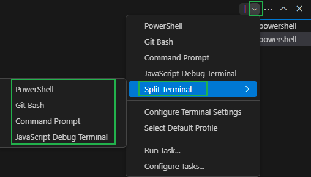

## CommonJS 规范
module.exports、exports 以及 require 这些都是 CommonJS 模块化规范中的内容。
而 Node.js 是实现了 CommonJS 模块化规范，二者关系有点像 JavaScript 和 ECMAScript

### 包管理工具

#### 概念介绍
##### 包是什么
[包]英文英文单词是package，代表了一组特定功能的源码集合
##### 包管理工具
管理[包]的应用软件，可以对[包]进行下载安装、更新、删除、上传等才做  
借助包管理工具，可以快速开发项目，提升开发效率  

##### 常用的包管理工具
* **npm**
* yarn
* cnpm

#### npm
npm 全称 **Node Package Manger**，翻译为中文意思是[Node 的包管理工具]  
npm 是 node.js官方内置的包管理工具，是**必须要掌握的工具**

##### npm的安装

node.js在安装时会 **自动安装npm**，所以如果你已经安装了node.js，可以直接使用npm  
可以通过 `npm -v` 查看版本号测试，如果显示版本号说明安装成功，反之安装失败 

##### npm基本使用

###### 初始化
创建一个空目录，然后以此目录作为工作目录启动**命令行工具**，执行 `npm init`  
`npm init` 命令的作用是将文件夹初始化为一个[包]，**交互式创建package.json文件**  
`package.json` 是包的配置文件，每个包都必须要有` package.json`

> 初始化过程还有一些注意事项：  
> 1. package name(**包名**)不能使用中文、大写，默认值是**文件夹的名称**，所以文件夹名称也不能使用中文和大写
> 2. version(**版本号**)要求`x.x.x`的形式定义，x必须是数字，默认值是`1.0.0`
> 3. ISC 证书与MIT证书功能上是相同的，关于开原证书扩展阅读
> 4. `package.json` 可以手动创建和修改
> 5. 使用 `npm init -y` 或者 `npm init --yes` 极速创建**package.json**

###### 搜索包

搜索包的方式有两种
1. 命令行 [`npm s/search 关键字`]
2. **网站搜索** 网址是[http://www.npmjs.com/](http://www.npmjs.com/)

###### 下载安装包
通过 `npm install` 和 `npm i` 命令安装包
```npm
<!-- 格式 -->
npm install <包名>
npm i <包名>

<!-- 示例 -->
npm install uniq
npm i uniq
```

```js
// 1.导入uniq包
// uniq:Removes all duplicates from an array in place
const uniq = require('uniq'); // 推荐
// const uniq = require('./node_modules/uniq');
// const uniq = require('./node_modules/uniq/uniq.js');

// 2.使用函数
let arr = [1,2,3,4,5,4,3,2,1];
const result = uniq(arr);
console.log(result);
// [ 1, 2, 3, 4, 5 ]
```

运行之后文件夹下会增加两个资源
* `node_modules` **文件夹**存放下载的包
* `package-lock.json` **包的锁文件**，用来锁定包的版本

> 安装 uniq 之后，uniq 就是当前这个包的一个**依赖包**，有时会简称为**依赖**  
> 比如我们创建了一个包名字为A，A中安装了包名字是B，我们就说**B是A的一个依赖包**，也会说**A依赖B**

###### require 导入 npm 包的基本流程

1. 在当前文件夹下 node_modules 中寻找同名的文件夹
2. 在上级目录中下的 node_modules 中训中同名的文件夹，直至找到磁盘根目录


##### 生产环境与开发环境

开发环境是程序员 **专门用来写代码** 的环境，一般是指程序员的电脑，开发环境的项目一般 **只能程序员自己访问**  
生产环境是项目**代码正式运行** 的环境，一般是指正式的服务器电脑，生产环境的项目一般 **每个客户否可以访问**  

##### 生产依赖与开发依赖
可以在安装时设置选项来区分**依赖的类型**，目前分为两类：

| 类型     | 命令                                |补充|
| :------: | ----------------------------------- |----| 
| 生产依赖 | npm i -S uniq <br> npm i --save uniq    | -S 等效于 --save，**-S 是默认选项**<br> 包信息保存在 package.json 中 **dependencies** 属性 |
| 开发依赖 | npm i -D less<br> npm i --save-dev less | -D 等效于 --save-dev<br> 包信息保存在package.json中 **devDependencies** 属性 |

##### 全局安装

可以执行安装选项 `-g` 进行全局安装  
`npm i -g nodemon`  
全局安装完成之后就可以在命令行的任何位置运行 `nodemon` 命令  `nodemon ./test.js`
该命令的作用是 **自动重启 node 应用程序**  
> 说明：
> 全局安装的命令不收工作目录位置影响
> 可以通过 `npm root -g` 可以查看全局安装包的位置
> **不是所有的包都适合全局安装**，只有全局类的工具才适合，可以通过[**查看包的官方文档来确定安装方式**](http://www.npmjs.com/)

###### 修改windows执行策略


windows 默认不允许 npm 全局命令执行脚本文件，所以需要修改执行策略
1. 以**管理员身份**打开powershell命令行
2. 键入命令 `set-ExecutionPolicy remoteSigned`

  
或者选择其他终端执行命令

###### 环境变量Path

Path是操作系统的一个环境变量，可以设置一些文件夹的路径，在当前工作目录下找不到可执行文件时，就会在环境变量Path的目录中挨个的查找，如果找到则执行，如果没有找到就会报错。

> 补充说明：
> * 如果希望某个程序在任何工作目录下都能正常运行，就应该将程序的所在目录配置到环境变量 Path 中
> * windows 下查找命令的所在位置
>   - **cmd 命令行**中执行 `where nodemon`
>   - **powershell命令**执行 `get-command nodemon `

##### 安装包依赖

在项目协作中有一个常用的命令就是 npm i,通过该命令可以依据 package.json 和 package-lock.json 的依赖声明安装项目依赖
```
npm i
npm install
```
> node_modules文件夹大多数情况都不会存入版本库

##### 安装指定版本的包
项目中可能会遇到版本不匹配的情况，有时就需要安装指定版本的包，可以使用下面的命令
```npm
<!-- 格式 -->
npm i <包名@版本号>
<!-- 实例 -->
npm i jquery@1.11.2
```
##### 删除依赖
项目中可能需要删除某些不需要的包，可以使用下面的命令
```npm
<!--局部删除-->
npm remove uniq
npm r uniq
<!-- 全局删除 -->
npm remove -g nodemon
```

##### 配置命令别名
通过配置命令别名可以更简单的执行命令
配置package.json中的 `scripts` 属性
```json
{
  ...
  "scripts": {
    "test": "echo \"Error: no test specified\" && exit 1",
    "server":"node test.js",
    "start": "node test.js"
  },
  ...
}
```

配置完成之后，可以使用别名执行命令  
`npm run server`    
`npm run start`  
**start** 别名比较特别，使用时可以省略 `run`  
`npm start`

> 补充说明：
> * `npm start` 是项目中常用的一个命令，一般用来启动项目
> * `npm run` 有自动向上级目录查找的特性，跟require函数也一样
> * 对于陌生的项目，可以通过查看scripts 属性来参考项目的一些操作

#### cnpm

##### cnpm 介绍
cnpm（China Node Package Manager） 是一个淘宝构建的 `npmjs.com` 的完整镜像，也称为[淘宝镜像],网址[http://npmmirror.com/](http://npmmirror.com/)  
cnpm 服务部署在国内 **阿里云服务器上**，可以提高包的下载速度  
官方也提供了一个全部工具包cnpm，操作命令与npm大体相同

##### cnpm安装

我们可以通过 npm 来安装cnpm 工具  
```
npm install -g cnpm --registry=https://registry.npmmirror.com
```
查看 cnpm 版本  
```
cnpm -v
```
##### 操作命令
|功能|命令|
|:-|:-|
|初始化|cnpm init |
|安装包|cnpm i uniq <br> cnpm i -S uniq<br>cnpm i -D uniq<br>cnpm i -g ndoemon|
|安装项目依赖|cnpm i|
|删除|cnpm r uniq|

##### npm 配置淘宝镜像
用 npm 也可以使用淘宝镜像，配置的方式有两种
* 直接配置
* 工具配置

###### 直接配置
执行如下命令即可完成配置  
```
npm config set registry https://registry.npmmirror.com/
```

###### 工具配置
使用 `nrm` （npm registry maneger）配置 npm 的镜像地址 
1. 安装 nrm  
    ```
    npm i -g nrm
    ```
2. 修改镜像  
    ```
    nrm use taobao
    ```
3. 检查配置是否成功(选做)  
    ```
    npm config list
    ```
    检查 registry地址是否为https://registry.npmmirror.com/，如果**是**则表明成功
    
> 补充说明：
> 1. **建议使用第二种方式**进行镜像配置，因为后续修改起来会比较方便
> 2. 虽然 cnpm 可以提高速度，但是 npm 也可以通过淘宝镜像进行加速，所以 **npm 的使用率还是高于cnpm**
> 3. 通过 `nrm ls` 可以查看当前配置的所有镜像源


#### yarn
##### yarn介绍

yarn 是由 Facebook 在2016 年推出的心得 Javascript 包管理工具，官方网址: [https://yarnpkg.com/](https://yarnpkg.com/)

##### yarn特点
yarn 官方宣称的一些特点
* 速度超快：yarn缓存了每个下载过的包，所以再次使用时无需重复下载，同时利用并行下载以最大化资源利用率，因此安装速度更快
* 超级安全：在执行代码之前，yarn会通过算法校验每个安装包的完整性
* 超级可靠：使用详细、简洁的锁文件格式和明确的安装算法，yarn能够保证在不同系统上无差异的工作

##### yarn安装
可以使用npm安装yarn  
`npm i -g yarn`

##### yarn常用命令

| 功能         | 命令                                                         |
| ------------ | ------------------------------------------------------------ |
| 初始化       | yarn init / yarn init -y                                     |
| 安装包       | yarn add uniq 生产依赖 <br>yarn add less -- dev 开发依赖 <br>yarn global add nodemon 全局安装 |
| 删除包       | yarn remove uniq 删除项目依赖包<br>yarn global remove nodemon 全局删除包 |
| 安装项目依赖 | yarn                                                         |
| 运行命令别名 | yarn <别名>  # 不需要添加 `run`                              |

> 思考题：
> 全局安装的包不可用，yarn全局安装包的位置可以通过`yarn global bin`来查看，然后将他的路径添加到环境变量中去。

##### yarn配置淘宝镜像
可以通过如下命令配置淘宝镜像
```
yarn config set registry https://registry.npmmirror.com/
```
可以通过`yarn config list`查看yarn的配置项

##### npm 和 yarn 选择
1. 个人项目
    如果是个人项目，**哪个工具都可以**，可以根据自己的喜好来选择
2. 公司项目
    如果是公司要根据项目代码来选择，可以**通过锁文件判断**项目的包管理工具
    * npm  的锁文件为 `package-lock.json`
    * yarn 的锁文件为 `yarn.lock`
    
> **包管理工具不要混着用！！**

#### 管理发布包

##### 创建与发布
我们可以将自己开发的工具包发布到 npm 服务上，方便自己和其他开发者使用，操作步骤如下：
1. 创建文件夹，并创建文件index.js，在文件中声明函数，使用 module.exports暴露
2. npm 初始化工具包，package.json填写包的信息（包的名字是唯一的）
3. 注册账号 [https://www.npmjs.com/signup](https://www.npmjs.com/signup)
4. 激活账号
5. 修改为官方的官方镜像（命令行中运行 `nrm usr npm`）
6. 命令行下`npm login`填写相关用户信息
7. 命令行下`npm publish`提交包

##### 更新包
后续可以对自己发布的包进行更新，操作步骤如下：
1. 更新包中的代码
2. 测试代码是否可用
3. 修改 **package.json** 中的版本号
4. 发布更新 `npm publish`

##### 删除包
执行如下命令删除包
`npm unpublish( --force)`

> 删除包需要满足一定的条件，[https://docs.npmjs.com/policies/unpublish](https://docs.npmjs.com/policies/unpublish)
> * 你是包的作者
> * 发布小于24小时
> * 大于24小时后，没有其他包依赖，并且每周小于300下载量，并且只有一个维护者

##### 扩展内容

在很多语言中都有包管理工具，比如：

| 语言       | 包管理工具          |
| ---------- | ------------------- |
| PHP        | composer            |
| Python     | pip                 |
| Java       | maven               |
| Go         | go mod              |
| JavaScript | npm/yarn/cnpm/other |
| Ruby       | rubyGems            |

除了编程语言领域有包管理工具之外，操作系统层面也存在包管理工具，不过这个包指的是[**软件包**]

| 操作系统 | 包管理工具 | 网址                               |
| -------- | ---------- | ---------------------------------- |
| Centos   | yum        | https://package.debian.org/stable/ |
| Ubuntu   | apt        | https://package.ubuntu.com/        |
| MacOS    | homebrew   | https://brew.sh/                   |
| Windows  | chocolatey | https://chocolatey.org/            |

#### nvm
##### 介绍
nvm 全称 **Node Version Manager** 顾名思义它是用来管理 node 版本的工具，方便切换不同版本的Node.js
##### 使用
nvm 的使用与 npm 相似
###### 下载安装
首先下载 nvm，下载地址[https://github.com/coreybutler/nvm-windows/releases](https://github.com/coreybutler/nvm-windows/releases),选择 **nvm-setup.exe** 下载
###### 常用命令

| 命令                  | 说明                          |
| --------------------- | ----------------------------- |
| nvm list available    | 显示所有可以下载的Node.js版本 |
| nvm list/nvm ls       | 显示已安装的版本              |
| nvm install 18.12.1   | 安装18.12.1版本的Node.js      |
| nvm install latest    | 安装最新版的Node.js           |
| nvm uninstall 18.12.1 | 删除某个版本的Node.js         |
| nvm use 18.12.1       | 切换18.12.1的Node.js          |


## ExpressJS

### express介绍
express 是一个基于 Node.js 平台的极简、灵活的WEB应用开发框架，官网[https://www.expressjs.com.cn/](https://www.expressjs.com.cn/) 简单来说，express是一个封装好的工具包，封装了很多功能，便于我们开发WEB应用（HTTP服务）

### express使用
```js
// 1.导入 express
const express = require('express')
// 2.创建应用对象
const app = express();
// 3.创建路由
app.get('/home',(req,res) => {
    res.end('hello express');
})
// 4.监听端口，启动服务
app.listen(3000,() => {
    console.log('服务已启动，正在监听端口3000...');
})
```

#### express下载
express本身是一个npm包，所以可以通过npm安装`npm i express`

#### express路由

**什么是路由**
> 路由确定了应用程序如何相应客户端对特定端点的请求

**路由的使用**
> 一个路由的组成有 **请求方法**，**路径**和**回调函数**组成
express 中提供了一系列方法，可以很方便的使用录用，使用格式如下：  
`app.<method>(path, callback)`

```js
// 1.导入 express
const express = require('express')
// 2.创建应用对象
const app = express();
// 3.创建路由
app.get('/',(req,res) => {
    res.end('hello');  // localhost:3000
})
app.get('/home',(req,res) => {
    res.end('hello express'); // localhost:3000/home
})
// post <form method="post" action="..."><button>submit</button></form>
app.post('/login',(req,res) => {
    res.end('login login'); 
})
// 匹配所有方法 get post
app.all('/test',(req,res) => {
    res.end('test test');
})
// 404 响应 上面都匹配不到时
app.all('*',(req,res) => {
    res.end('404 not found');
})
// 4.监听端口，启动服务
app.listen(3000,() => {
    console.log('服务已启动，正在监听端口3000...');
})
```

**获取请求参数**
express 框架封装了一些 API 来方便获取请求报文中的数据，并且兼容原生HTTP模块的获取方式
```js
// 1.导入 express
const express = require('express')
// 2.创建应用对象
const app = express();
// 3.创建路由
// http://127.0.0.1:3000/request
app.get('/request',(req,res) => {

    // 原生操作
    console.log(req.method); // GET
    console.log(req.url); // /request?a=1&b=2
    console.log(req.httpVersion); //1.1 
    console.log(req.headers);

    // exporess 操作
    console.log(req.path); // /request
    console.log(req.query); //{ a: '1', b: '2' }

    // 获取 ip
    console.log(req.ip); //(localhost) ::1 ->ipv6 环回地址;(127.0.0.1)::ffff:127.0.0.1

    // 获取请求头
    console.log(req.get('host')); // 127.0.0.1:3000
    res.end('hello');  // localhost:3000
})

// 4.监听端口，启动服务
app.listen(3000,() => {
    console.log('服务已启动，正在监听端口3000...');
})
```

##### 获取路由参数
路由参数指的是 URL 路径中的参数（数据）
```js
app.get('/:id.html',(req,res) => {
    // 获取 URL 路由参数
    console.log(req.params.id);
    // http://127.0.0.1:3000/789.html -> 789
    // http://127.0.0.1:3000/123.html -> 123
    res.setHeader('content-type','text/html;charset=utf-8');
    res.end('hello'); 
})
```

##### 路由参数练习
路由结构：`/singer/1.html`，显示歌手的**姓名**和**图片**
```js
// 导入 express
const express = require('express')
// 导入singer.json文件
const {singers} = require('./singer.json');
// 创建应用对象
const app = express();
// 创建路由
app.get('/singer/:id.html',(req,res) => {
    // 获取 URL 路由参数
    let {id} = req.params
    console.log(id);
    let result = singers.find(s => {
        if(Number(id) === s.id){
            return true;
        }
    });
    if(!result){
        res.statusCode = 404;
        res.end(`<h1>404 NOT FOUND</h1>`);
    }
    res.setHeader('content-type','text/html;charset=utf-8');
    res.end(
        `<!DOCTYPE html>
        <html lang="en">
        <head>
            <meta charset="UTF-8">
            <meta name="viewport" content="width=device-width, initial-scale=1.0">
            <title>Document</title>
        </head>
        <body>
            <p>${result.singer_name}</p>
            
        </body>
        </html>`); 
})

// 监听端口，启动服务
app.listen(3000,() => {
    console.log('服务已启动，正在监听端口3000...');
})

```
```json
{
    "singers":[
        {
            "singer_name":"周杰伦",
            "singer_pic":"https://y.gtimg.cn/music/photo_new/T001R150x150M0000025NhlN2yWrP4.webp",
            "other_name":"Jay Chou",
            "singer_id":4558,
            "id":1
        },
        {
            "singer_name":"林俊杰",
            "singer_pic":"https://y.gtimg.cn/music/photo_new/T001R150x150M000001BLpXF2DyJe2.webp",
            "other_name":"JJ Lin",
            "singer_id":4286,
            "id":2
        },
        {
            "singer_name":"G.E.M.邓紫棋",
            "singer_pic":"https://y.gtimg.cn/music/photo_new/T001R150x150M000001fNHEf1SFEFN.webp",
            "other_name":"Gloria Tang",
            "singer_id":13948,
            "id":3
        }
    ]
}
```

#### express响应设置
express 框架封装了一些API来方便给客户端相应数据，并且兼容原生HTTP模块的获取方式
```js
app.get('/response',(req,res) => {
    // 原生响应
    res.statusCode = 200;
    res.statusMessage = 'love';
    res.setHeader('xxx','yyy');
    res.write('hello express ');
    res.end('response');
    // express 响应
    res.status(500);
    res.set('aaa','bbb');
    res.send('你好 Express');
    // 或者
    res.status(500).set('abc','def').send('it is ok');
    
    // 其他响应设置
    
    // 跳转响应
    res.redirect('https://baidu.com');
    // 下载响应
    res.download(__dirname + '/singer.json');
    // JSON 响应
    res.json({
        name:'chen',
        slogon:'nice'
    })
    // 响应文件内容
    res.sendFile(__dirname + '/login.html'); // path.resolve()
});


```

#### expres 中间件

##### 什么是中间件
**中间件（Middleware）本质是一个回调函数**
**中间件函数**可以像路由回调一样访问**请求对象（request）、响应对象（response）**

##### 中间件的作用
**中间件的作用**就是**使用函数封装公共操作，简化代码**

##### 中间件的类型

* 全局中间件（进站口）
* 路由中间件（检票口）

###### 定义全局中间件
**每一个请求**到达服务端之后**都会执行全局中间件函数**

**全局中间件例子**
```js
/**
 * 记录每个请求的 url 和 IP 地址
 */
const express = require('express');
const fs = require('fs');
const path = require('path');
const app = express();
function recordMiddleware(req, res, next){
    // 获取 url 和 ip
    let {url,ip} = req;
    let filePath = path.resolve(__dirname,'./memory.log');
    // 将信息保存在 memory.log中
    fs.appendFileSync(filePath,`${url} ${ip}\r\n`);
    // 调用 next
    next();
}
app.use(recordMiddleware);
app.get('/admin',(req,res) => {
    res.send('hello admin');   
});

app.get('/test',(req,res) => {
    res.send('hello test');   
});

app.listen(3000,() => { 
    console.log('服务器已打开，端口3000正在监听中...');
})
```

memory.log
```log
/test ::ffff:127.0.0.1
/admin ::ffff:127.0.0.1
```
**路由中间件例子**
```js
/**
 * 针对 /admin /setting 的请求，要求 URL 携带 code=521 参数，如未携带提示 [暗号错误]
 */

const express = require('express');
const app = express();
// 声明中间件
let checkCodeMiddleware=(req, res, next) => {
    if(req.query.code === '521'){
        next();
    }
    else{
        res.send('暗号错误');
    }
}
// app.use(checkCodeMiddleware);
app.get('/home',(req,res) => {
    res.send('hello home');
});
app.get('/setting',checkCodeMiddleware,(req,res) => {
    res.send('hello setting');
});
app.get('/admin',checkCodeMiddleware,(req,res) => {
    res.send('hello admin');
});

app.listen(3000,() => {
    console.log('服务已启动，正在监听端口3000...');
})
```

##### 静态资源中间件
```js
// 静态资源中间件设置
app.use(express.static(__dirname + '/public'));
```

> 注意事项：
> 1. index.html文件为默认打开的资源
> 2. 如果静态资源与路由规则同时匹配，谁先匹配谁就响应
> 3. 路由响应动态资源，静态资源中间件响应静态资源

```js
// 在局域网中，其他设备可以通过ip:port访问到该电脑上的网页
const express = require('express');

const app = express();

app.use(express.static(__dirname + '/public')); // 先被匹配到，执行index.html里面的内容 

app.get('/', (req, res) => { // 后被匹配到，不执行

  res.send('hello home');

})

app.listen(3000, () => {

  console.log('服务已启动，正在监听端口3000...')

})
```

##### 获取请求数据 body-parser

express 可以使用 `body-parser` 包处理请求体

第一步：安装

```npm i body-parser```

第二步：导入 body-parser 包

```const bodyParser = require('body-parser');```

第三步：获取中间件函数

```js
// 处理querystring 格式的请求体
let urlParser = bodyParser.urlencoded({extended:false});
// 处理 JSON 格式的请求体
let jsonParser = bodyParser.json();
```

第四步：设置路由中间件，然后使用 `request.body`来获取请求体数据


````js
/**
 * 按照要求搭建 HTTP 服务
 * 
 * GET   /login   显示表单网页
 * POST  /login   获取表单中的 [用户名] 和 [密码] 
 * getreqbodydata.js
 */
const express = require('express');
const app = express();
const bodyParser = require('body-parser');

// 解析 JSON 格式的请求体的中间件
// const jsonParser = bodyParser.json();

// 解析 querystring 格式请求体的中间件
let urlencodedParser = bodyParser.urlencoded({extended:false});

app.get('/login', (req, res) => {
    // 响应 HTML 文件内容
    res.sendFile(__dirname+'/getreqbodydata.html');
});

app.post('/login', urlencodedParser, (req, res) => {
    console.log(req.body);
    // [Object: null prototype] { username: 'admin', password: 'admin' }
    res.send('获取表单用户名和密码');
});

app.listen(3000, () => {
    console.log('server is running...')
})

```
````

```html
// getreqbodydata.html
<form action="/login" method="post"> 
    <!-- action url 简写 会自动拼接完整url-->
     用户名：<input type="text" name="username"><br>
     密码：<input type="password" name="password"><br>
     <button>登录</button>

</form>
```

